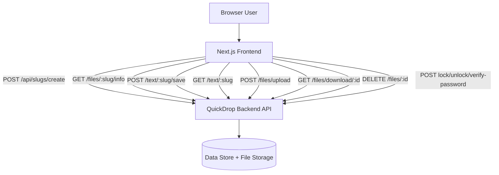

# QuickDrop Frontend

QuickDrop is an anonymous, no-login sharing web app for text and files with custom slug links and optional lock/unlock access control.

Live URL: https://quickdrop.cloud/

## Table of Contents

- Product Overview
- Key Features
- Tech Stack
- Architecture
- Frontend Flow
- Project Structure
- API Contract Used by Frontend
- Local Development
- Environment Variables
- Build and Run
- Quality and Engineering Standards
- Security and Privacy Notes
- Deployment Notes
- Known Gaps and Improvement Backlog

## Product Overview

QuickDrop allows users to:

- Create a custom slug from the home page.
- Open a dedicated slug workspace page.
- Write and save text content.
- Upload, list, download, and delete files.
- Lock/unlock pages with password verification.
- Share temporary links with expiry controlled from the home page.

No user registration is required.

## Key Features

- Anonymous usage without accounts.
- Custom URL creation through slug generation.
- Combined text editor + file vault on each slug page.
- Password-gated edit/download operations when locked.
- Expiration duration selector (1 hour to 7 days).
- Responsive UI with interaction feedback and toasts.

## Tech Stack

- Framework: Next.js 16 (App Router)
- Language: JavaScript (React 19)
- Styling: Tailwind CSS v4 + component-level styled-jsx blocks
- HTTP Client: Axios (+ native fetch in home page slug creation)
- Icons: lucide-react
- Linting: ESLint 9 + eslint-config-next

## Architecture



### Frontend Route Design

- `/` : Landing + slug creation + expiration selection.
- `/[slug]` : Shared workspace for text and file operations.
- `/about` : Product information.
- `/terms` : Terms and conditions.

### Component Responsibility (Current)

- `app/page.js`
	- Slug input normalization.
	- Expiration selection and slug creation request.
	- Link copy helper.
- `app/[slug]/page.js`
	- Workspace state orchestration.
	- Page lock/unlock and password verification flow.
	- Text CRUD and file upload/download/delete behavior.
- `lib/api.js`
	- Axios client wrapper and frontend API methods.

## Frontend Flow

1. User enters desired slug on `/`.
2. Frontend normalizes slug and calls backend create endpoint.
3. On success, user is navigated to `/{slug}`.
4. Slug page fetches metadata + existing text + files.
5. User performs save/upload/download/delete operations.
6. If page is locked, password verification is required before protected actions.

## Project Structure

```text
app/
	layout.js            # Root layout + metadata
	globals.css          # Global styles + Tailwind import
	page.js              # Landing page
	[slug]/page.js       # Slug workspace page
	about/page.js        # About page
	terms/page.js        # Terms page
lib/
	api.js               # API client layer
public/                # Static assets
```

## API Contract Used by Frontend

Configured in `lib/api.js` with:

- Base URL from `NEXT_PUBLIC_API_URL`
- Fallback: `http://localhost:5000/api`

Methods used:

- `GET /slugs/check/:slug`
- `POST /slugs/create`
- `GET /files/:slug/info`
- `POST /files/upload`
- `GET /files/download/:id`
- `DELETE /files/:id`
- `POST /files/:slug/lock`
- `POST /files/:slug/unlock`
- `POST /files/:slug/verify-password`
- `POST /text/:slug/save`
- `GET /text/:slug`

## Local Development

### Prerequisites

- Node.js 20+
- npm 10+
- Backend API running and reachable

### Install

```bash
npm install
```

### Run Dev Server

```bash
npm run dev
```

Open http://localhost:3000

## Environment Variables

Create `.env.local` in the frontend root:

```env
NEXT_PUBLIC_API_URL=http://localhost:5000/api
```

For production, point it to your backend API base URL.

## Build and Run

```bash
npm run lint
npm run build
npm start
```

## Quality and Engineering Standards

This project currently follows:

- App Router based route separation.
- API abstraction in `lib/api.js`.
- Strict mode enabled in Next config.
- ESLint integration for code quality.

Recommended industry-standard additions (next steps):

- Add TypeScript for safer API contracts and state models.
- Add centralized error boundary + loading UI patterns.
- Add unit/integration tests (Jest + RTL) and E2E tests (Playwright).
- Add API retry/timeout policies and standardized error mapping.
- Add observability (frontend logs, tracing, analytics events).
- Add CI pipeline with lint/test/build gates and preview deployments.

## Security and Privacy Notes

- This frontend supports password-protected pages through backend verification endpoints.
- Frontend must not store plaintext passwords in persistent storage.
- Always use HTTPS in production for API and site.
- Validate and sanitize user-provided content on backend before persistence.
- Add rate-limiting and abuse controls at API/gateway level.

## Deployment Notes

- Framework supports deployment to Vercel, Azure Static Web Apps, or containerized hosting.
- Ensure `NEXT_PUBLIC_API_URL` points to production backend.
- Keep backend CORS configuration aligned with frontend origin.
- Keep route fallback and CDN cache settings compatible with App Router.

## Known Gaps and Improvement Backlog

- Home page currently uses direct `fetch` with a hardcoded backend URL for slug creation; this should be centralized through `lib/api.js` and env-based config.
- Some UI copy still references legacy product naming in static pages.
- Add accessibility audit for keyboard and screen reader support across modals.
- Add request cancellation for long-running uploads and page transitions.

---

Maintained by QuickDrop team.
